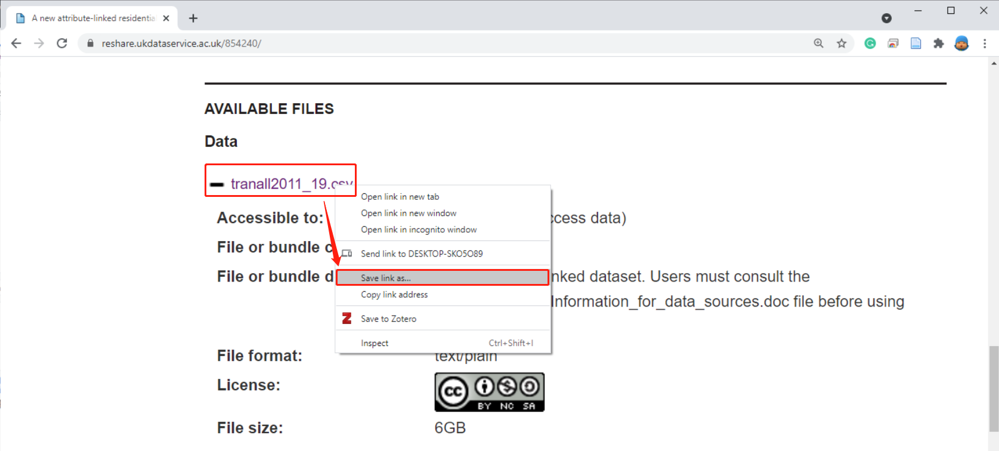
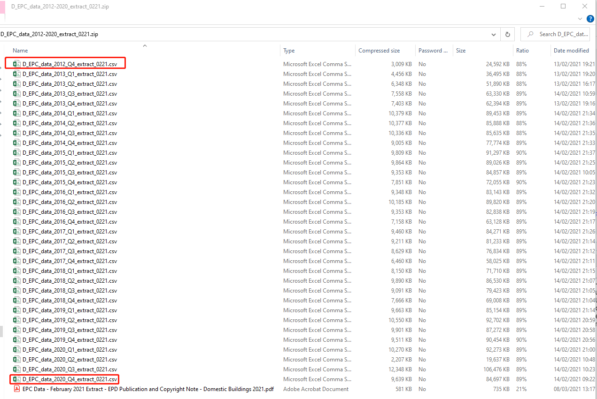

# Recommended resources
  
## Resources for handling big data in R
  
 -   [Handling large data sets in R](https://rpubs.com/msundar/large_data_analysis)
  

> **Notes:**
>
> Medium sized datasets (< 2 GB):loaded in R ( within memory limit but processing is cumbersome (typically in the 1-2 GB range )
>
> Large files that cannot be loaded in R due to R / OS limitations 
>
> - Large files(2 - 10 GB):process locally using some work around solutions
>
> - Very Large files( > 10 GB):needs distributed large scale computing.

 -   [Five ways to handle Big Data in R](https://www.r-bloggers.com/2013/11/five-ways-to-handle-big-data-in-r/)
  

> **Notes:**
>
> Rule of thumb:
>
> Data sets that contain up to one million records can easily processed with standard R.
>
> Data sets with about one million to one billion records can also be processed in R, but need some additional effort.
>
> Data sets that contain more than one billion records need to be analyzed by map reduce algorithms. 
 
 -   [Efficient data carpentry](https://csgillespie.github.io/efficientR/data-carpentry.html)
    
 -   [Getting Started With Parallel Programming In R](https://towardsdatascience.com/getting-started-with-parallel-programming-in-r-d5f801d43745)
  

 -   [Efficiency in Joining Two Data Frames](https://www.r-bloggers.com/2013/01/efficiency-in-joining-two-data-frames/)
  
 -   [For large tables in R dplyr's function inner_join() is much faster than merge()](http://zevross.com/blog/2014/04/30/mini-post-for-large-tables-in-r-dplyrs-function-inner_join-is-much-faster-than-merge/)
  
 -   [BASE R, THE TIDYVERSE, AND DATA.TABLE: A COMPARISON OF R DIALECTS TO WRANGLE YOUR DATA](https://wetlandscapes.com/blog/a-comparison-of-r-dialects/)
  
 -   [Speed comparison of rbind, bind_rows, and rbindlist](https://rstudio-pubs-static.s3.amazonaws.com/406521_7fc7b6c1dc374e9b8860e15a699d8bb0.html)
  
 -   [dplyr backends: multidplyr 0.1.0, dtplyr 1.1.0, dbplyr 2.1.0](https://www.tidyverse.org/blog/2021/02/dplyr-backends/)
  
> rbindlist() is the fastest method and rbind() is the slowest. bind_rows() is half as fast as rbindlist()
  
## Resources for the data.table package
  
 -   [Data Transformation with data.table : : CHEAT SHEET](file:///C:/Users/casa-alienware%20Bin%20C/Documents/Downloads/datatable%20(6).pdf)
  
 -   [A data.table and dplyr tour](https://atrebas.github.io/post/2019-03-03-datatable-dplyr/)
  
 -   [Data.Table – everything you need to know to get you started in R](https://hutsons-hacks.info/data-table-everything-you-need-to-know-to-get-you-started-in-r)
 
 -   [Blazing Fast Data Wrangling With R data.table](https://towardsdatascience.com/blazing-fast-data-wrangling-with-r-data-table-de5045cc4b4d)
  
 -   [data.table in R – The Complete Beginners Guide](https://www.machinelearningplus.com/data-manipulation/datatable-in-r-complete-guide/)
  
 -   [Advanced tips and tricks with data.table](http://brooksandrew.github.io/simpleblog/articles/advanced-data-table/)
  
 -   [Advanced-Data Wrangling In R — 4](https://medium.com/analytics-vidhya/advanced-data-wrangling-in-r-4-f98693b92851)
  
 -   [R : DATA.TABLE TUTORIAL (WITH 50 EXAMPLES)](https://www.listendata.com/2016/10/r-data-table.html)
    
## Resources for measuring R performance
   
 -   [5 ways to measure running time of R code](https://www.r-bloggers.com/2017/05/5-ways-to-measure-running-time-of-r-code/)
    
 -   [Measuring performance](https://adv-r.hadley.nz/perf-measure.html#perf-measure)
   
 -   [Efficient optimisation](https://csgillespie.github.io/efficientR/performance.html)
   
 -   [Profvis — Interactive Visualizations for Profiling R Code](https://rstudio.github.io/profvis/)
  
 -   [Strategies to Speedup R Code](https://www.r-bloggers.com/2016/01/strategies-to-speedup-r-code/)
  
 -   [R Code Optimizer](https://rpubs.com/IACCancu/462493)
  
 -   [Strategies to Speedup R Code](https://www.r-bloggers.com/2016/01/strategies-to-speedup-r-code/)
   
 -   [R Performance Tuning | Learn Tips to Improve Speed & Memory of R Programs](https://data-flair.training/blogs/r-performance-tuning-techniques/)
  
## Resources for PostGIS database
  
 -   [About PostGIS](https://postgis.net/)
  
 -   [Install Postgres/PostGIS and get started with spatial SQL](http://zevross.com/blog/2019/12/04/install-postgres-postgis-and-get-started-with-spatial-sql/)
  
 -   [Enabling PostGIS](https://postgis.net/install/)
  
>PostGIS is an optional extension that must be enabled in each database you want to use it in before you can use it.
  
## Resources for Alteryx software
  
 -   [What is Alteryx?](https://www.youtube.com/watch?v=F8MSnofnItM)
  
 -   [Data Cleansing in Alteryx for Beginners](https://www.youtube.com/watch?v=FzefmS9Fu7Y)
  
 -   [Integrating R in Alteryx](https://www.theinformationlab.co.uk/2018/11/12/integrating-r-in-alteryx/)
  
 -   [Alteryx - Bring Your Own R Code](https://www.youtube.com/watch?v=nVYLRM-mbtk)
  
 -   [How do I Import & Union Multiple Excel Files with Alteryx](https://www.youtube.com/watch?v=MjGxzsMJINQ)
  
 -   [The Union tool in Alteryx](https://www.youtube.com/watch?v=v8xS0wrU6JA)
  
 -   [The unique tool in Alteryx](https://www.youtube.com/watch?v=ueLeDn85E98)
  
 -   [How to Connect Alteryx to PostgreSQL](https://www.youtube.com/watch?v=RDly0ycZ2IE)
  
## Datasets
  
 -  [Research data](https://reflect.ucl.ac.uk/casahousing/2021/01/11/research-data/)
  
 -  [Energy Performance of Buildings Data: England and Wales](https://epc.opendatacommunities.org/)
  
 -  [Land Registry Price Paid Data(PPD)](https://www.gov.uk/government/statistical-data-sets/price-paid-data-downloads)
  
 -  [A new attribute-linked residential property price dataset for England and Wales 2011-2019](https://reshare.ukdataservice.ac.uk/854240/)
  

 - [Scottish Energy Performance Certificate Register](https://www.scottishepcregister.org.uk/)
  
 - [Scottish Domestic Energy Performance Certificates](https://statistics.gov.scot/data/domestic-energy-performance-certificates)
   

  
 -  [Scottish Non-domestic Energy Performance Certificates](https://statistics.gov.scot/data/non-domestic-energy-performance-certificates)
      
## Extensions
    
 - [Big Data: Wrangling 4.6M Rows with dtplyr](https://www.business-science.io/code-tools/2019/08/15/big-data-dtplyr.html)
  
 - [Big Data Analytics with R](https://www.dropbox.com/sh/4m63647jbg7a1yy/AACa5TqdjBwOwchOpOa9s_Pda)
  
 - [R and Hadoop Data Analytics - RHadoop](https://dzone.com/articles/r-and-hadoop-data-analytics)
  
 - [R and Hadoop: Step-by-step tutorials](https://blog.revolutionanalytics.com/2012/03/r-and-hadoop-step-by-step-tutorials.html) 
  
 -  [Mastering Spark with R](https://therinspark.com/)  
  
 -  [Hadoop Vs Spark - Detailed Comparison](https://phoenixnap.com/kb/hadoop-vs-spark) 
   
 -  [GOOGLE](https://www.google.com/)