# Getting started
  
## Installing packages

If you have installed the below packages already, you can jump to the next step.
```{r,eval=FALSE}
install.packages("data.table")
install.packages("dplyr")
install.packages("sqldf")
install.packages("RPostgreSQL")
install.packages("profvis")
```


## Loading packages
Load the packages for today's talk  
```{r}

library(data.table)
library(sqldf)
library(RPostgreSQL)
library(dplyr)
library(profvis)

```

## Install PostGIS and Alteryx software
### Install PostGIS
+ Step 1: download the PostgreSQL
<center>

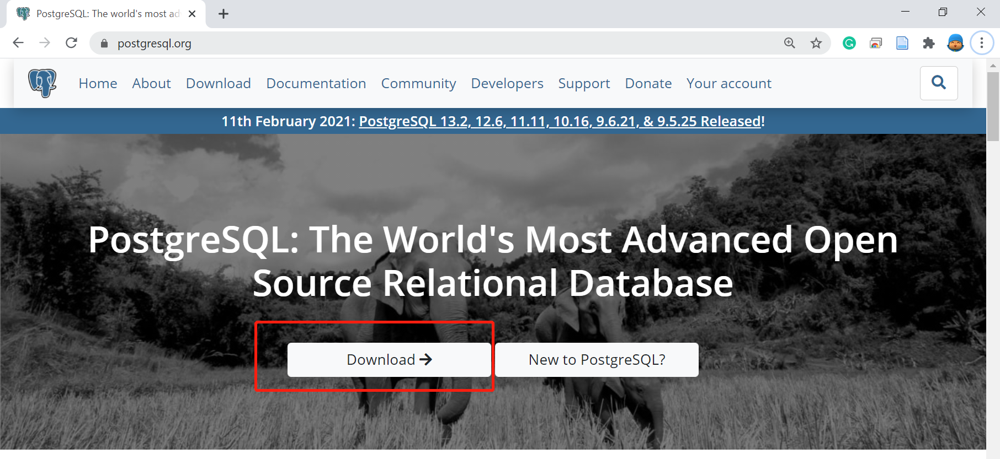
</center>


+ Step 2: select the right version for your system
<center>

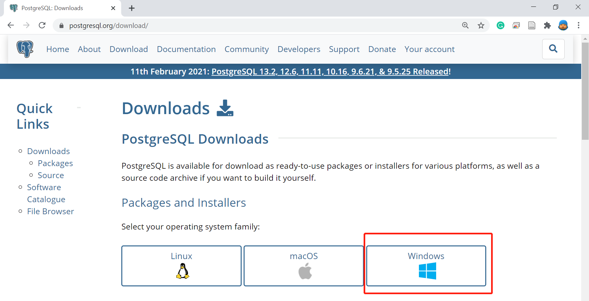
</center>
+  Step 3: download the installer
<center>

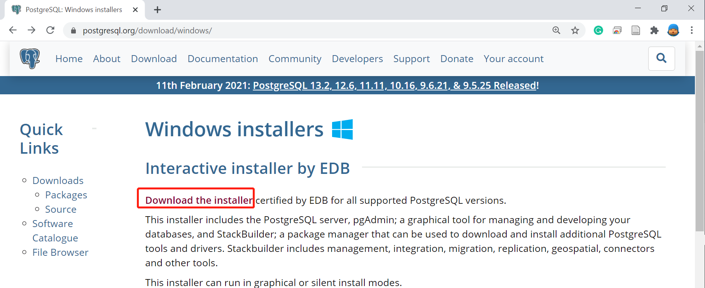
</center>
+  Step 4: download the software
<center>

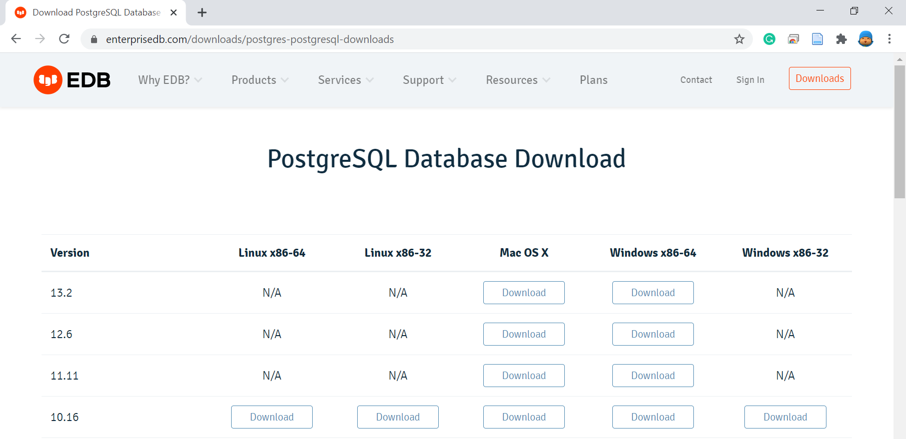
</center>
+ Step 5: install the PostgreSQL
<center>

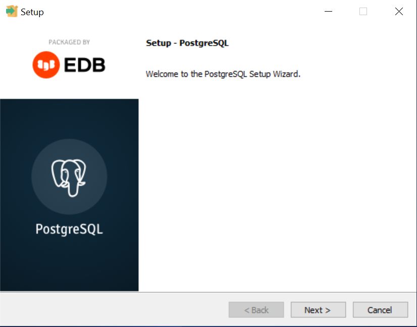
</center>
+  Step 6: set the password
<center>

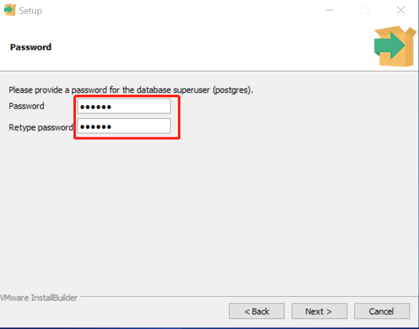
</center>
+  Step 7: select the port number
<center>

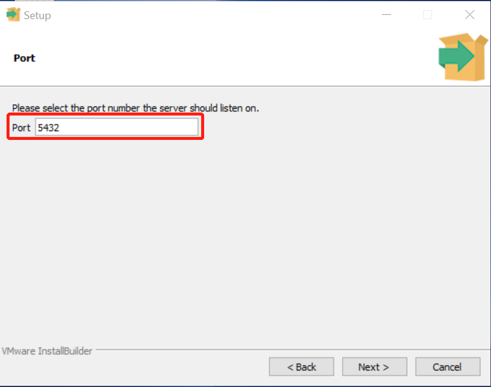
</center>
+  Step 8: click the Stack Builder
<center>

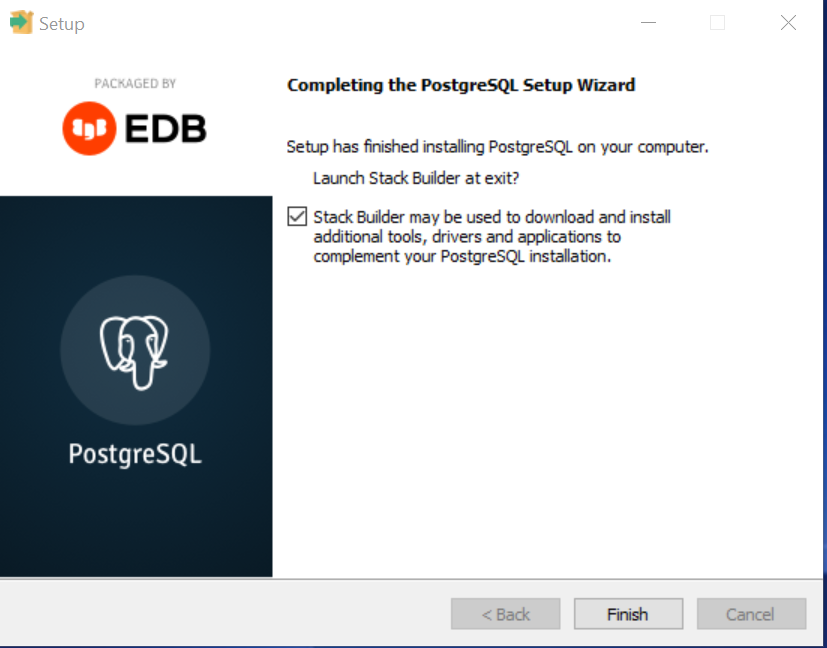
</center>
+  Step 9: choose the PostgreSQL for additional installation
<center>

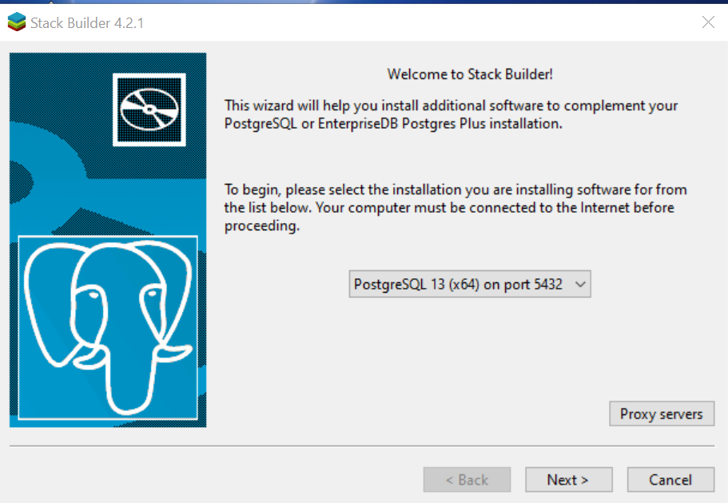
</center>
+  Step 10: install the spatial extension
<center>

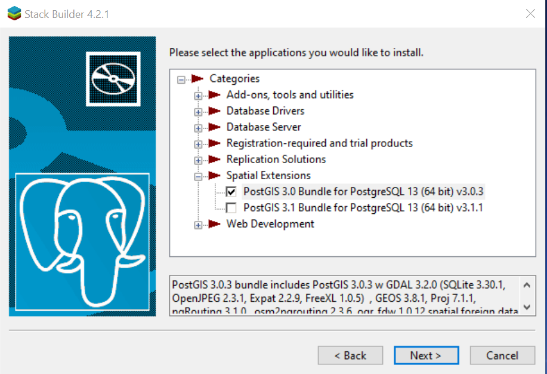
</center>
+  Step 11: create a postGIS database
<center>

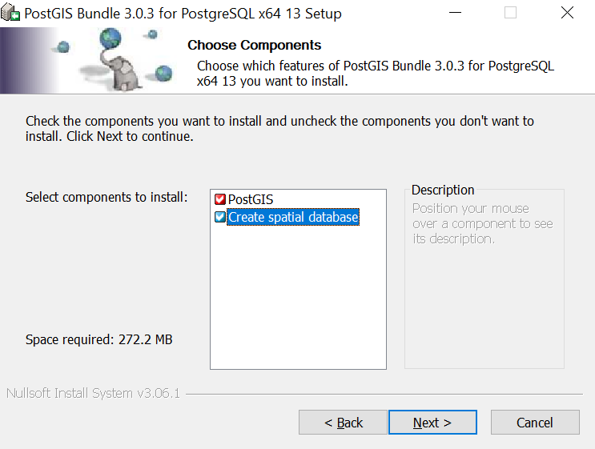
</center>

+  Step 12: Enter the password
<center>

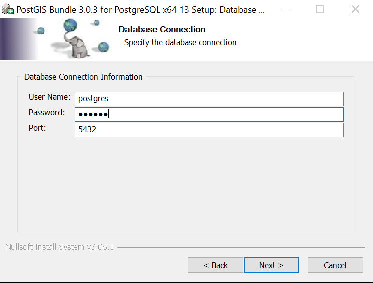
</center>

+ Step 13: set the database name
<center>

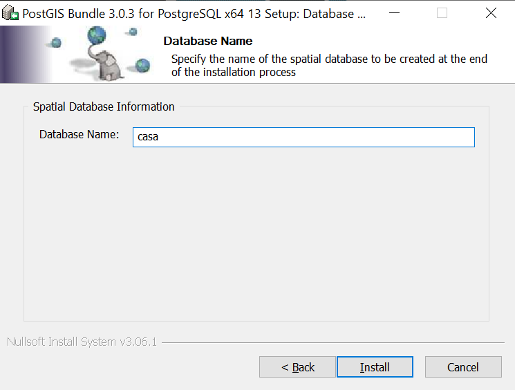
</center>
+  Step 14: Finish
<center>

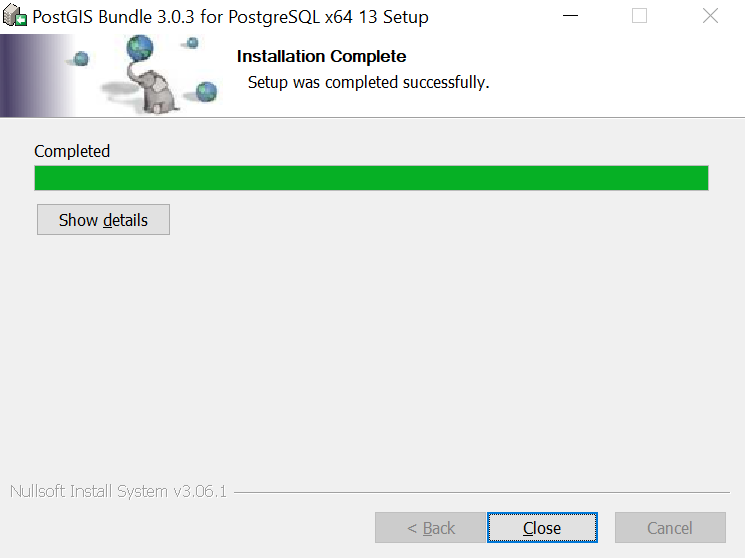
</center>
***
You will find a PostGIS database names as casa in your postgreSQL
<center>

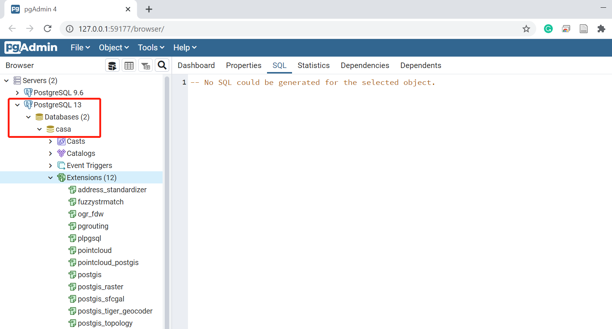
</center>
**The second approch:** create a database in PostgreSQL + extent it to PostGIS database ([Enabling PostGIS](https://postgis.net/install/))
<center>

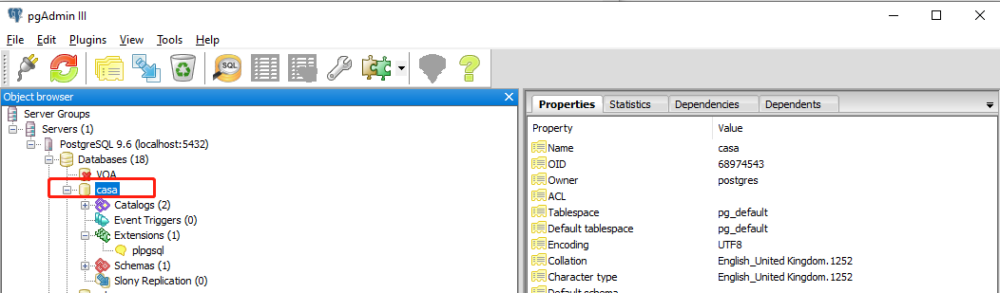
</center>


### Install Alteryx
For academics, students, nonprofits institutes, you can install the Alteryx for free through [Alteryx for Good](https://www.alteryx.com/why-alteryx/alteryx-for-good).

(1) Step 1: Apply the Alteryx For Good License
<center>

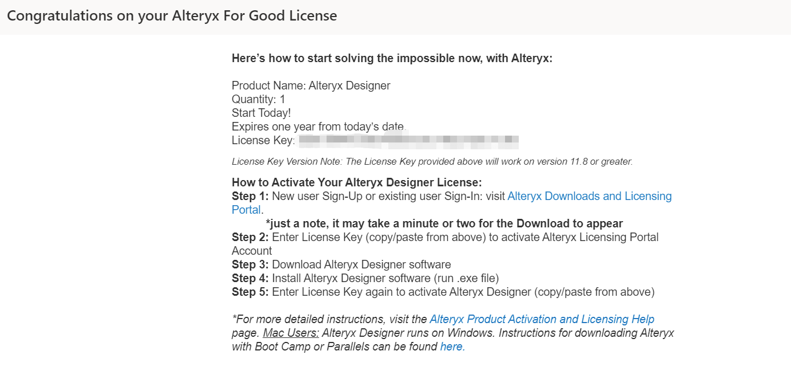
</center>

(2) Step 2: Click the Alteryx Designer in Product Downloads

<center>

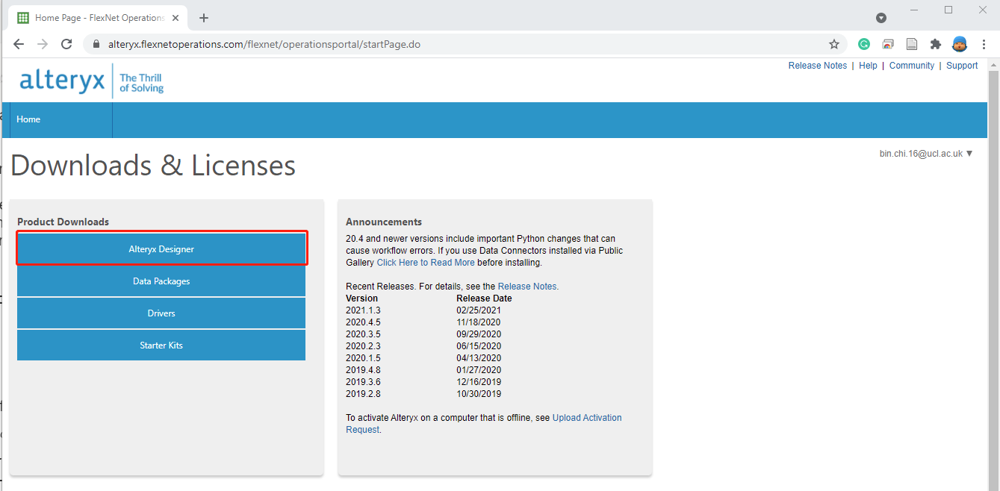
</center>

(3) Step 3: click the Alteryx Designer (2021.1)

<center>

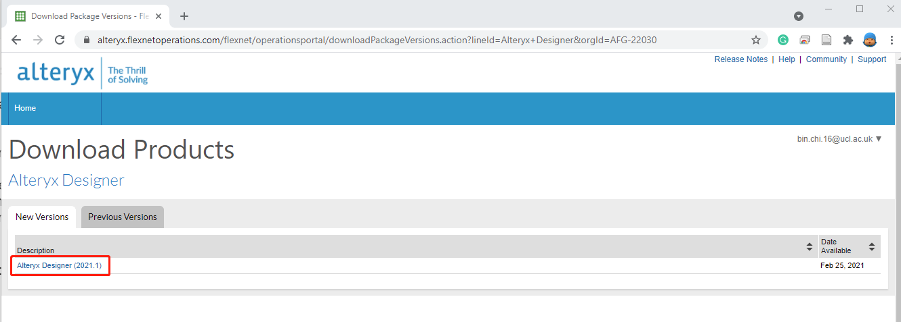
</center>


(4) Step 4: download the Alteryx Designer and Alteryx Predictive Tools

<center>

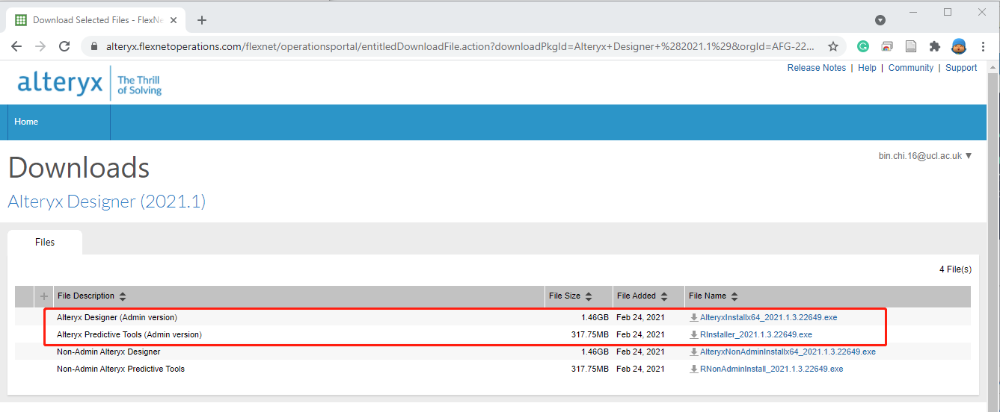
</center>

