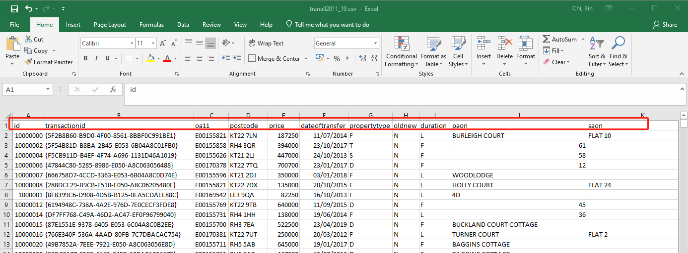
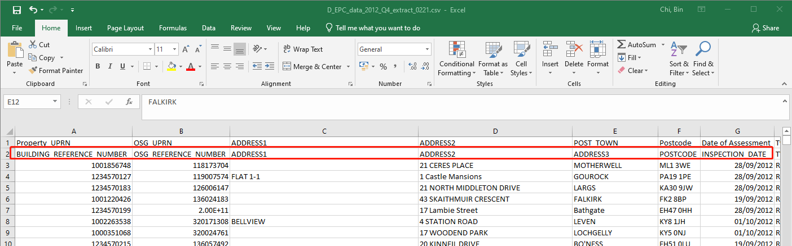
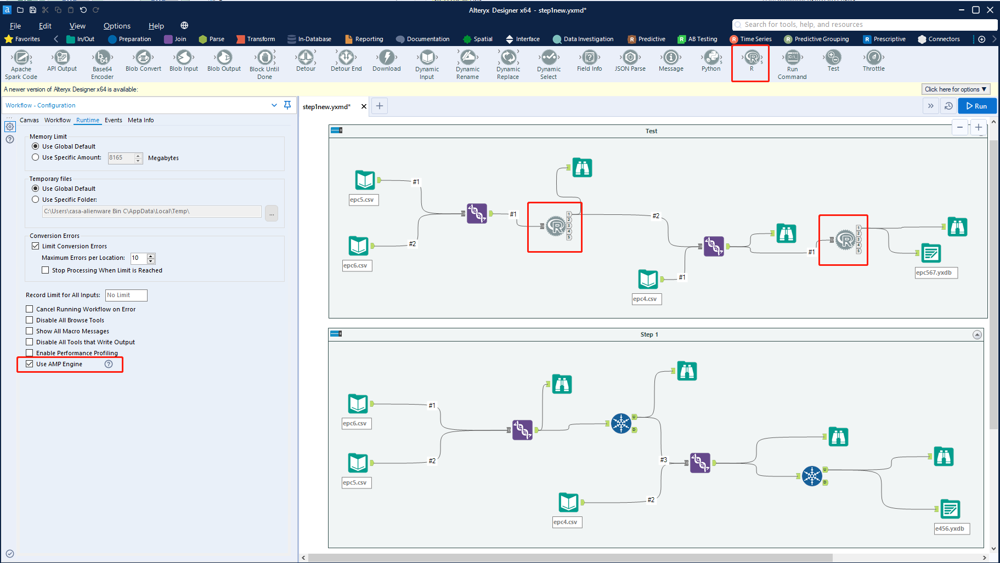
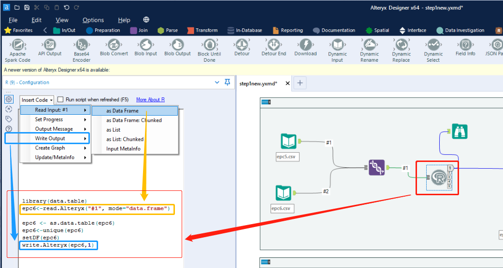
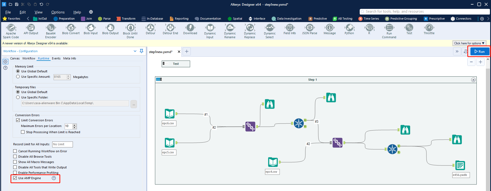
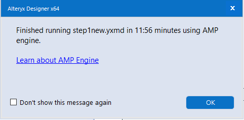
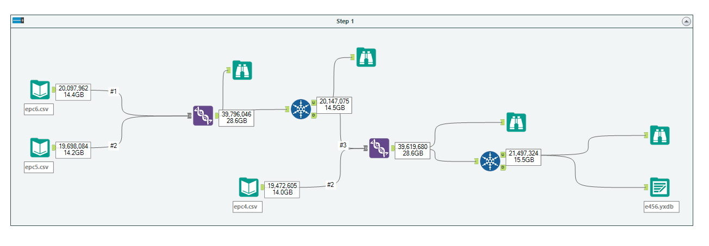

# Working with big data in R

## Read in CSV files

### Read one large CSV file 

#### Read a CSV file with header
</center>

</center>
```{r}
library(data.table)

##It will take around 3 mins to read in 5,732,838 records with 105 variables
tran2<-fread("tranall2011_19.csv")

```


#### Read a CSV file without header

```{r,eval=FALSE}

tran2<-fread("tranall2011_19.csv",header=F)

```

#### Read a CSV file with the second row as header and dropping the first row
<center>


</center>
```{r}

epcdata1<-fread("D_EPC_data_2012_Q4_extract_0221.csv", skip = 1)
epcdata14<-read.csv("D_EPC_data_2020_Q4_extract_0221.csv", skip = 1)

```


### Fast reading multiple EPC csv files together in R

#### Code for reading in EPCs in England and Wales
```{r,eval=FALSE}
## assume all the unzipped EPC stored in EPC folder in D drive


x1 <- list.files(path = ".", pattern = NULL, all.files = FALSE,
                 full.names = FALSE, recursive = FALSE)


datalist <- paste("D:/EPC",x1,"certificates.csv",sep="/")

epcdata = data.table::rbindlist(lapply(datalist, data.table::fread, showProgress = FALSE))

```

#### Code for reading in EPCs in Scotland

```{r,eval=FALSE}
datalist = list.files(pattern="*.csv")

epcdata = data.table::rbindlist(lapply(datalist, data.table::fread, skip=1,showProgress = FALSE))

```


## Basic larger dataset munging/wrangling
### Select columns

```{r}

class(tran2)

needlist<-c("transactionid","postcode","price","dateoftransfer","propertytype","laua","lad11nm","tfarea","priceper","TRANSACTION_TYPE")

tran2<-tran2[,..needlist]

head(tran2)
```


### Changing column names to lower case or upper case
#### Changing column names to lower case
```{r}

setnames(tran2, tolower(names(tran2)))

head(tran2)

```


#### Changing column names to upper case

```{r,eval=FALSE}

setnames(tran2, toupper(names(tran2)))

```


### Filter rows based on conditions

```{r}

tran2[laua=="E09000007", ]

Camden<-tran2[laua=="E09000007", ]
head(Camden)
```

### Add in the ID column
```{r}

Camden[,tranid := .I]
head(Camden)

#Camden[, tranid := .I+1000000]
```

### Convert datatable values to uppercase
```{r}

Camden[,  `:=`(tran_type = toupper(transaction_type))]
head(Camden)
```

### Delete columns


```{r}

Camden[,transaction_type:=NULL]

head(Camden)
```


### Remove Duplicates
```{r}

dim(Camden)

unique(Camden)

dim(Camden)

```


### Write files
```{r,eval=FALSE}

fwrite(Camden,"Camden.csv")

```

### Bind datasets

```{r}

# Bind by names
class(epcdata1)
class(epcdata14)

# Convert data.frame to data.table
setDT(epcdata14)


# Select columns
needlist<- c("BUILDING_REFERENCE_NUMBER","OSG_REFERENCE_NUMBER","ADDRESS1","ADDRESS2","ADDRESS3","POSTCODE","INSPECTION_DATE","LODGEMENT_DATE","PROPERTY_TYPE","TYPE_OF_ASSESSMENT","TRANSACTION_TYPE","TOTAL_FLOOR_AREA","NUMBER_HABITABLE_ROOMS","CURRENT_ENERGY_EFFICIENCY","POTENTIAL_ENERGY_EFFICIENCY")

epcdata1<-epcdata1[,..needlist]
epcdata14<-epcdata14[,..needlist]

# Bind by names
l = list(epcdata1,epcdata14)
epc<- rbindlist(l, use.names=TRUE)

# Remove Duplicates
dim(epc)
unique(epc)
dim(epc)
```
## Work with PostGIS database in R
### Write files to PostGIS
```{r,eval=FALSE}

drv <- dbDriver("PostgreSQL")
con <- dbConnect(drv, dbname = "casa",port=5432, user="postgres",password=******)
dbWriteTable(con, "Camden",value=Camden, append = TRUE, row.names = FALSE)

```


### Read files from PostGIS
```{r,eval=FALSE}

drv <- dbDriver("PostgreSQL")
con <- dbConnect(drv, dbname = "casa",port=5432, user="postgres",password=******)
tran<- dbGetQuery(con,"select * from Camden") 

```


## Measure code performance

### Measure running time of the code
```{r}
class(epc)
# Delete the epc object
rm(epc)
# Bind by names
start_time <- Sys.time()
epc<-rbindlist(list(epcdata1,epcdata14),use.names=TRUE)
end_time <- Sys.time()

end_time - start_time

# Convert data.table to data.frame
setDF(epcdata1)
setDF(epcdata14)

# Combine two data frames by rows
start_time <- Sys.time()
epcdata<-rbind(epcdata1,epcdata14)
end_time <- Sys.time()
end_time - start_time

# Convert data.frame to data.table
setDT(epcdata14)
setDT(epcdata1)

# Combine two data tables by position
start_time <- Sys.time()
epc<-rbindlist(list(epcdata1,epcdata14))
end_time <- Sys.time()

end_time - start_time

```


### 

```{r,eval=FALSE}
library(profvis)

uniqueresult <- function(x){
  
  dt <- as.data.table(x)
  
  esummary<-dt[,.(count=.N),by=epcdataid]
  
  idd1 <- esummary[esummary$count==1,]
  
  result1 <- x[x$epcdataid %in% idd1$epcdataid,]
  
  return(result1)
}


```


## Execute R code in Alteryx 
<center>


</center>

+ Step 1: build a workflow in Alteryx

<center>


</center>

+ Step 2: create R code in the Alteryx

<center>


</center>

+ Step 3: Click the use AMP engine and run the workflow

<center>


</center>

+ Step 4: Finish

<center>


</center>

<center>


</center>

**Notes:** If you have any questions about Alteryx, [Steve](https://twitter.com/steven4320555) at [Billigence](https://billigence.com/solutions/business-intelligence/) would like to help.


