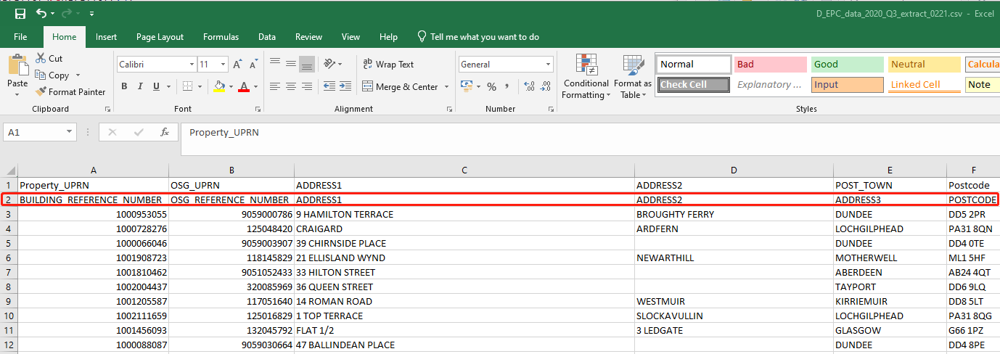

# Working with big data in R

## Read CSV files

### Read one large CSV file 

(1) Read CSV file with header

```{r}
library(data.table)
Sys.time()
##It will take 3 mins to read in 5,732,838 records with 105 variables
tran2<-fread("tranall2011_19.csv")
Sys.time()
```


(2) Read CSV file without header

```{r,echo = FALSE}

#tran2<-fread("tranall2011_19.csv")

```

(3) Read CSV file with the second row as header
<center>


</center>
```{r}

epcdata13<-read.csv("D_EPC_data_2020_Q3_extract_0221.csv", skip = 1)
epcdata14<-read.csv("D_EPC_data_2020_Q4_extract_0221.csv", skip = 1)

```


### Fast reading multiple EPC csv files together in R

(1) Code for read in EPCs in England and Wales
```{r}

#x1 <- list.files(path = ".", pattern = NULL, all.files = FALSE,
                 #full.names = FALSE, recursive = FALSE)
## assume all the unzip EPC is store in EPC floder in D drive
#datalist <- paste("D:/EPC",x1,"certificates.csv",sep="/")

#epcdata = data.table::rbindlist(lapply(datalist, data.table::fread, showProgress = FALSE))

```

(2) Code for read in EPCs in Scotland

```{r}
#datalist = list.files(pattern="*.csv")

#epcdata = data.table::rbindlist(lapply(datalist, data.table::fread, skip=1,showProgress = FALSE))

```


## Basic big data munging/wrangling
### Select columns

```{r}

class(tran2)
needlist<-c("id","transactionid","postcode","price","dateoftransfer","propertytype","msoa11","laua","tfarea","numberrooms","priceper","CURRENT_ENERGY_EFFICIENCY","POTENTIAL_ENERGY_RATING","WALLS_ENERGY_EFF")
tran2<-tran2[,..needlist]
head(tran2)
```


### Changing column names to lower case or upper case
#### Changing column names to lower case
```{r}

#setnames(tran2, tolower(names(tran2)))

```


#### Changing column names to upper case

```{r}

#setnames(tran2, toupper(names(tran2)))

```


### Filter rows

```{r}

#setnames(tran2, toupper(names(tran2)))

```

### Add in ID column
```{r}

#epcdata[, epcdataid := .I]

```

### Covert datatable values to uppercase
```{r}

#epcdata[,  `:=`(add1 = toupper(address1),
               # add2 = toupper(address2),
               # add3 = toupper(address3),
                #add = toupper(address))]

```

### Join datasets
```{r}

#epcdata<-rbind(epcdata13,epcdata14)

```


### Get unique records
```{r}

#sepcdata<-unique(epcdata)

```


### Join datasets


### Write files
```{r}

#fwrite(tran2,"tran2.csv")

```


## Work with PostGIS database in R
### Write files in PostGIS
```{r}

#drv <- dbDriver("PostgreSQL")
#con <- dbConnect(drv, dbname = "casa",port=5432, user="postgres",password=******)
#dbWriteTable(con, "tran2",value=tran2, append = TRUE, row.names = FALSE)

```


### Read files from PostGIS
```{r}

#drv <- dbDriver("PostgreSQL")
#con <- dbConnect(drv, dbname = "casa",port=5432, user="postgres",password=******)
#tran<- dbGetQuery(con,"select * from tran2") 

```


## Measure code performance

### 


###

## Execute R code in Alteryx 